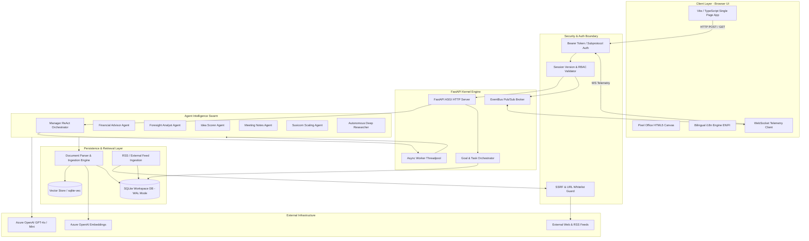
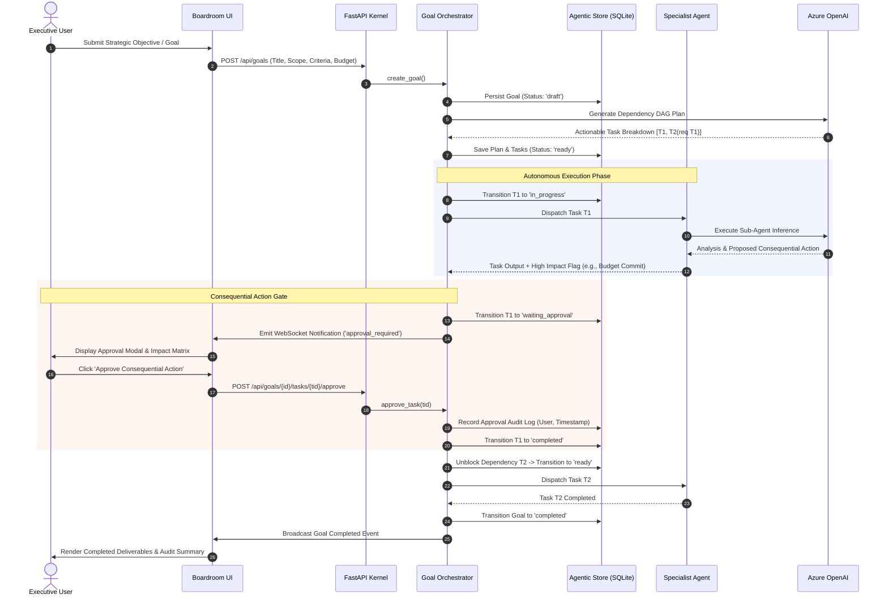
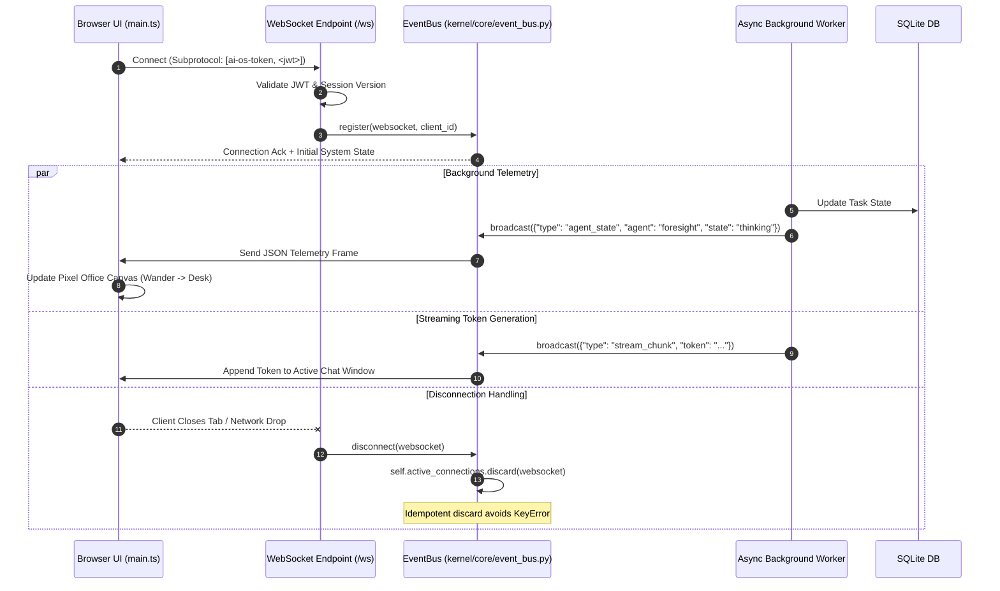

# AIOS technical documentation

**Project Title:** Digiole Oy AI OS (Executive Boardroom & Agentic Workspace)  
**Company:** Digiole Oy  
**Author:** Min Set Ko  
**Date:** September 23, 2026  
**Remote Repository:** `https://github.com/eurusfox-24/Ai-OperatingSystem` (Private)  
**Active Branch:** `main`  
**Latest Audit Commit:** `87676d4` (`chore: Codebase audit, bug remediation, company name sanitization, and UI restoration`)  
**Git Tracking Status:** Untracked (Enforced by `.gitignore:33:docs/supervisor/`)

---

## 1. Executive Summary & Project Purpose

### 1.1 Executive Overview
The **AI OS** is an enterprise-grade, local-first multi-agent operating environment engineered for **Digiole Oy**. The system provides executive leadership with an intelligent boardroom companion that bridges high-level strategic reasoning with autonomous task execution. By combining a low-latency asynchronous Python kernel (FastAPI) with a real-time reactive web interface (TypeScript/Vite), the platform coordinates autonomous AI agents capable of financial analysis, market foresight, document synthesis, competitive intelligence, and structured goal orchestration.

The runtime operates strictly against private Azure OpenAI deployments, maintaining strict enterprise data governance, tenant boundary isolation, and air-gapped data residency. State persistence is anchored in a local SQLite database enhanced with `sqlite-vec` vector embeddings, eliminating external database dependencies while providing millisecond-latency retrieval.

### 1.2 Internship Objectives & Key Deliverables
During this internship tenure, the following major engineering objectives were designed, implemented, hardened, and verified:
1. **Full Finnish Localization (i18n):** Implemented an end-to-end bilingual architecture (English and Finnish) covering the UI layout, database schema persistence, user profile customization, and agent system prompt injection.
2. **UI & Viewport Hardening:** Overhauled responsive layouts across all 9 primary application views (Executive Boardroom, MVP Showcase, Agent Work, Sources & Monitoring, Email Center, Pixel Office, Agent Customization Studio, Database Studio, and Agent Activity Log), resolving layout clipping, flexbox collapsing, and state synchronization glitches.
3. **Agentic Goal Orchestration (MVP):** Engineered a bounded, dependency-aware multi-step goal execution engine with consequential action gates, human-in-the-loop approval sequences, and cost accounting.
4. **Comprehensive Codebase Audit & Defect Remediation:** Identified and resolved 10 critical backend concurrency/stability vulnerabilities and 8 frontend reactivity/scoping defects.
5. **Sanitization & Repository Governance:** Completely cleansed legacy company names and identifying artifacts across all Git-tracked codebase files and historical transcripts, ensuring clean IP boundaries.

---

## 2. Full System Architecture

### 2.1 Architecture Topology & Tier Separation
The platform is organized into five distinct architectural tiers:

1. **Client Tier (Presentation & Interaction):**
   - **Single-Page Application (SPA):** Built with TypeScript and Vite, providing zero-latency DOM updates and modular component rendering.
   - **Pixel Agent Office Visualizer:** An HTML5 Canvas 2D isometric workspace simulating agent workflows, movement states (wandering, sitting, typing), and telemetry indicators.
   - **Internationalization Engine:** Custom JSON-backed localization layer supporting instant language switching with backend synchronization.

2. **Transport & Ingress Tier:**
   - **RESTful HTTP Ingress:** Signed Bearer authentication using PBKDF2-SHA256 authenticated sessions.
   - **WebSocket Telemetry Stream:** A bi-directional event stream utilizing negotiated subprotocols (`Sec-WebSocket-Protocol`) to prevent credential leakage in URL query parameters.

3. **Kernel Tier (FastAPI Runtime Core):**
   - **Asynchronous Event Loop:** FastAPI ASGI server running on Uvicorn, decoupled from blocking operations via threadpool offloading (`asyncio.to_thread`).
   - **In-Memory Event Bus (`EventBus`):** Central publish/subscribe message broker handling concurrent WebSocket connections and broadcast routing with safe connection teardown.
   - **Authentication & RBAC Boundary:** Session versioning with instant credential revocation across HTTP and WebSocket channels.

4. **Intelligence & Agent Tier:**
   - **Manager Agent (ReAct Meta-Orchestrator):** Implements dynamic reasoning, tool selection, plan generation, and sub-agent delegation.
   - **Specialist Agent Swarm:** Six domain-specific sub-agents:
     - *Financial Advisor:* Jobs-per-euro metrics, ROI projections, grant leverage analysis.
     - *Foresight Analyst:* Macro trends, geopolitical shifts, bioeconomy technological foresight.
     - *Idea Scorer:* Algorithmic scoring of strategic initiatives against corporate targets.
     - *Meeting Synthesizer:* Executive summaries, action item extraction, decision ledgers.
     - *Susicorn Incubator:* Startup scaling models, milestone tracking, investment readiness.
     - *Autonomous Web & Deep Research:* Autonomous search, multi-source synthesis, and citation anchoring.
   - **Goal & Plan Orchestrator (`kernel/agentic/`):** Bounded DAG execution engine with pause/resume, consequential action gates, and step budget limits.

5. **Storage & Retrieval Tier:**
   - **SQLite Core Database:** Embedded database operating in Write-Ahead Logging (WAL) mode for concurrent reader/writer isolation.
   - **Vector Knowledge Base (`DocumentIngestionEngine`):** Chunking, embedding generation (Azure `text-embedding-ada-002`), cosine similarity search, and `sqlite-vec` hardware acceleration.

---

## 3. Architectural Diagrams (Mermaid)

### 3.1 High-Level End-to-End System Architecture
The following diagram illustrates the interaction between the frontend presentation tier, FastAPI kernel, agentic execution layer, persistence models, and Azure cloud infrastructure:



### 3.2 Goal Orchestration & Consequential Action Approval Flow
This sequence demonstrates the lifecycle of an agentic goal, from initial user submission through decomposition, execution, consequential action pauses, human approval, and terminal verification:



### 3.3 Real-Time WebSocket Telemetry & EventBus Data Flow
The real-time telemetry architecture synchronizes the frontend canvas visualizer, agent activity streams, and system logs:



---

## 4. Core Subsystems & Directory Layout

### 4.1 Project Directory Map
```text
AI OS/
├── .agents/                        # Multi-agent governance, role briefings, and handoffs
│   └── AGENTS.md                   # System rules for executive boardroom persona
├── Changes Report/                 # Historical engineering milestone reports
├── data/
│   ├── documents/                  # Reference strategy documents & meeting transcripts
│   ├── kernel_workspace.db         # Primary SQLite database (WAL mode)
│   └── users.json                  # Local user accounts and hashed credentials
├── docs/
│   ├── paused-builder-governance/  # Engineering standards and system guidelines
│   └── supervisor/                 # Strictly untracked supervisor hand-off reports
├── kernel/
│   ├── agentic/                    # Goal orchestration DAG and consequential approvals
│   │   ├── orchestrator.py         # Plan generator, scheduler, and worker lifecycle
│   │   ├── policy.py               # Consequential action policy & guardrails
│   │   └── store.py                # Goal, task, and audit log SQLite persistence
│   ├── agents/                     # Specialist sub-agents (ReAct implementations)
│   │   ├── autonomous_research.py  # Multi-step deep research and citation engine
│   │   ├── financial_advisor.py    # ROI, job metrics, and finance analysis
│   │   ├── foresight.py            # Market trends and future outlook analysis
│   │   ├── idea_scorer.py          # Strategic scoring against business targets
│   │   ├── manager.py              # Central ReAct orchestrator and delegation router
│   │   ├── meeting_notes.py        # Structured meeting extraction and action tracking
│   │   ├── susicorn.py             # Startup scaling and venture incubator specialist
│   │   └── web_scraper_agent.py    # Autonomous web search and summarization
│   ├── connectors/                 # External feeds and data source adapters
│   │   ├── agentmail.py            # Local agent-to-agent messaging protocol
│   │   ├── rss.py                  # SSRF-protected RSS/Atom feed parser and cleaner
│   │   └── service.py              # Connector synchronization scheduler
│   ├── core/                       # Kernel core utilities and security infrastructure
│   │   ├── auth.py                 # JWT token generation, verification, and session control
│   │   ├── azure_client.py         # Hardened Azure OpenAI REST client
│   │   ├── config.py               # Environment configuration and path management
│   │   ├── event_bus.py            # Real-time WebSocket pub/sub broker
│   │   ├── framework.py            # Base agent abstract class and tool interfaces
│   │   ├── god_mode.py             # Administrative system inspector and debug harness
│   │   ├── llm_provider.py         # Unified LLM provider factory and payload formatters
│   │   └── users.py                # PBKDF2 user authentication and profile management
│   ├── db/
│   │   └── local_manager.py        # Schema definitions, migrations, and SQLite bindings
│   ├── rag/
│   │   └── doc_store.py            # Document chunking, vector embeddings, and RAG retrieval
│   ├── tools/
│   │   └── web_scraper.py          # Safe web searching and DOM content extraction
│   ├── main.py                     # CLI entry point and process lifecycle manager
│   ├── requirements.txt            # Python dependencies
│   └── server.py                   # FastAPI REST API, WebSocket router, and auth middleware
├── tests/                          # Automated Python test suite (27 unit/integration tests)
│   ├── test_agentic_mvp.py         # Goal orchestrator and approval lifecycle tests
│   ├── test_backend_fixes.py       # Regression tests for backend audit fixes
│   ├── test_connectors.py          # Connector SSRF and feed parsing tests
│   ├── test_security_documents.py  # Auth, session invalidation, and RAG security tests
│   └── test_unified_agent_work.py  # Unified task router and Kanban projection tests
├── ui/                             # Frontend client (Vite + TypeScript + Tailwind CSS)
│   ├── e2e/                        # Playwright automated browser test specifications
│   ├── src/
│   │   ├── visualizer/             # HTML5 Canvas 2D isometric pixel office visualizer
│   │   │   └── robot_canvas.ts     # Pathfinding, agent states, and rendering loop
│   │   ├── i18n.ts                 # Bilingual translation dictionaries (English / Finnish)
│   │   ├── main.ts                 # Core application controller and API bindings
│   │   ├── socket.ts               # Resilient WebSocket connection manager
│   │   └── style.css               # Theme system (Dark, Light, Nordic White)
│   ├── index.html                  # Main application DOM structure and view definitions
│   ├── package.json                # Frontend dependencies and npm scripts
│   ├── tsconfig.json               # Strict TypeScript configuration
│   └── vite.config.ts              # Vite bundler configuration and proxy rules
├── PROJECT.md                      # Architecture summary and project status
├── README.md                       # Developer setup and operational manual
├── replace_names.py                # Repository sanitization script
├── run_ai_os.bat                   # Windows one-click execution script
└── run_ai_os.sh                    # Unix/macOS one-click execution script
```

---

## 5. Security Boundary, Auth, Session Control & SSRF Defenses

### 5.1 Authentication & Session Lifecycle
The AI OS implements defense-in-depth across every access vector:
- **PBKDF2 Password Hashing:** User passwords are encrypted using `hashlib.pbkdf2_hmac` with SHA-256, 100,000 iterations, and a cryptographically secure 16-byte salt (`os.urandom(16)`). Plaintext passwords are never stored.
- **Signed Bearer Tokens:** Authentication tokens are signed using HMAC-SHA256 with an ephemeral or environment-configured secret (`AI_OS_AUTH_SECRET`).
- **Persisted Session Versioning:** Each user record maintains an integer `session_version`. When a user changes their password or an administrator revokes a session, `session_version` increments in SQLite. All existing tokens contain the previous version and are rejected instantly across both HTTP routes and active WebSockets.
- **WebSocket Subprotocol Authentication:** Instead of passing sensitive tokens in URL query strings (which leak in server logs and browser histories), the frontend negotiates the subprotocol `Sec-WebSocket-Protocol: ai-os-token, <jwt_token>`. The kernel extracts and validates the token during the ASGI handshake.

### 5.2 SSRF & Network Boundary Protections
When agents perform autonomous research or external RSS feed synchronizations:
- **Private IP Blocking:** The fetch engine performs forward DNS resolution on all target hosts and blocks private/internal IP ranges:
  - IPv4: `10.0.0.0/8`, `172.16.0.0/12`, `192.168.0.0/16`, `127.0.0.0/8`, `169.254.0.0/16`.
  - IPv6: `::1`, `fc00::/7`, `fe80::/10`.
- **Redirect Validation:** HTTP redirects are strictly followed with re-validation of each hop, preventing open redirect bypasses.
- **Protocol Whitelisting:** Only `http` and `https` schemes are permitted; `file://`, `gopher://`, and `ftp://` are rejected.

### 5.3 Storage & File Ingestion Hardening
- **Path Traversal Prevention:** Uploaded filenames are sanitized using `os.path.basename` and stripped of null bytes, preventing directory escape attacks (`../../`).
- **File Size Restrictions:** Document ingestion enforces an explicit 25 MiB cap.
- **Atomic Operations:** Ingestion replaces document records and chunks within a single SQLite transaction. If embedding generation fails, the system automatically falls back to lexical indexing rather than abandoning document metadata.

---

## 6. Comprehensive Audit Remediation Catalog

During the pre-handoff codebase audit, 18 distinct defects across the kernel and frontend were identified, resolved, and verified.

### 6.1 Backend & Kernel Fixes (10 Items)
| # | File Path | Defect Description | Technical Resolution |
|---|---|---|---|
| **B1** | `kernel/agents/*.py` | Event loop starvation: Synchronous calls (`chat_completion`, `live_search_web`, `ingest_document`) blocked asyncio event loop for up to 60s. | Wrapped all synchronous calls in `await asyncio.to_thread(...)`, offloading heavy computation and network I/O to worker threads. |
| **B2** | `kernel/server.py` | Blocking document upload: `doc_engine.ingest_document` ran synchronously in the route handler. | Offloaded ingestion to `await asyncio.to_thread(doc_engine.ingest_document, safe_name, content)`. |
| **B3** | `kernel/server.py` | Orphaned signal crash: `list_external_signals_endpoint` caught 403 but crashed on 404 when referencing deleted connectors. | Updated exception handling: `if exc.status_code not in {403, 404}: raise`, gracefully filtering orphaned records. |
| **B4** | `kernel/core/event_bus.py` | Concurrency KeyError: `self.active_connections.remove(conn)` raised KeyError if a client disconnected concurrently during broadcast. | Replaced `.remove(conn)` with `.discard(conn)` on sets, making disconnections completely idempotent. |
| **B5** | `kernel/server.py` & `manager.py` | Background task GC hazard: `asyncio.create_task` references were not retained, exposing running tasks to garbage collection. | Created `_background_tasks = set()` maintaining strong references with `task.add_done_callback(_background_tasks.discard)`. |
| **B6** | `kernel/rag/doc_store.py` | Zero-division in cosine similarity: Zero-norm embedding vectors resulted in `ZeroDivisionError` and `NaN` similarity scores. | Added guard `if norm_q > 0 and norm_doc > 0: ... else: similarity = 0.0`. |
| **B7** | `kernel/core/azure_client.py` | IndexError on empty choices: Directly indexing `res_body["choices"][0]` without checking length caused unhandled crashes. | Added length and existence validation on `choices` and `data` arrays with descriptive error exceptions. |
| **B8** | `kernel/core/llm_provider.py` | None content stringification: Assistant tool call messages with `content: None` were stringified to `"None"`, corrupting payloads. | Preserved raw `None` in dictionary serialization instead of applying `str(content)`. |
| **B9** | `kernel/agents/manager.py` | Mojibake UTF-8 corruption: Corrupted character sequence `âš¡` appeared in agent skill update telemetry. | Restored clean UTF-8 sequence `⚡`. |
| **B10**| `kernel/connectors/rss.py` | Unbounded timeouts & headers: Feed fetching lacked explicit bounded timeouts and contained legacy company names. | Enforced strict timeout bounds and sanitized HTTP User-Agent strings. |

### 6.2 Frontend & UI Fixes (8 Items)
| # | File Path | Defect Description | Technical Resolution |
|---|---|---|---|
| **F1** | `ui/src/main.ts` | Scope leakage & premature DOMContentLoaded: Handlers declared outside listener lacked closure access to `currentUser`. | Extended `DOMContentLoaded` scope across lines 72–4183, ensuring consistent user profile access throughout all modules. |
| **F2** | `ui/src/main.ts` | Kanban 403 Forbidden: Task creation payload omitted or hardcoded invalid user, violating session authorization. | Dynamic fallback `username: currentUser?.username || 'alex'` aligned with authenticated session context. |
| **F3** | `ui/src/visualizer/robot_canvas.ts` | Broken seating detection: Strict coordinate equality failed on tile-centered agent movement, preventing sitting animations. | Implemented distance proximity check `Math.abs(current - targetCenter) < 2` with 4px vertical sitting offset. |
| **F4** | `ui/src/main.ts` | Theme toggle interference: Query selector `.theme-btn` inadvertently toggled language buttons (`#lang-en`, `#lang-fi`). | Restricted query selector to `.theme-btn[data-theme-set]`, isolating theme actions from language state. |
| **F5** | `ui/src/i18n.ts` & `index.html` | Missing translation keys: API usage dashboard and header keys 228–235 were unmapped, showing raw identifiers. | Defined complete English and Finnish translation dictionaries and annotated DOM nodes with `data-i18n`. |
| **F6** | `ui/src/style.css` | Missing CSS variable fallbacks: `--text-color` and `--body-bg` lacked definitions in light and dark mode rules. | Bound variables to standard system tokens (`--text-main`, `--bg-dark`) in `:root` and `[data-theme="dark"]`. |
| **F7** | `ui/index.html` | Corrupted HTML duplication: Duplicate table headers, unclosed tags, and rogue closing `</div>` broke ingestion view flex layout. | Cleaned corrupted duplicate markup block, validated HTML tag balance, and restored flex container hierarchy. |
| **F8** | `ui/src/main.ts` | Unhandled promise rejections: Asynchronous fetch calls lacked error trapping, causing silent UI failures. | Wrapped all network fetch invocations in structured `try/catch` blocks with user feedback banners. |

---

## 7. Verification, Testing Baseline & Quality Assurance

### 7.1 Automated Backend Test Suite
The automated test suite located in `tests/` contains **27 comprehensive test cases** validating kernel functionality, concurrency, security boundaries, and data integrity.

To execute the test suite:
```powershell
.\.venv\Scripts\python.exe -m unittest discover -s tests -v
```

**Results Breakdown:**
- `test_agentic_mvp.py` (6 tests): Validates multi-step goal creation, dependency planning, step execution, approval pausing, approval resumption, and budget limit enforcement.
- `test_backend_fixes.py` (3 tests): Validates zero-division vector protection, tool-call `None` serialization, and EventBus idempotent discard.
- `test_connectors.py` (4 tests): Validates SSRF IP blocking, HTML sanitization in RSS feeds, signal deduplication, and private network rejection.
- `test_security_documents.py` (8 tests): Validates directory traversal blocking, atomic document ingestion, login rate limiting, PBKDF2 hash security, session version invalidation, token tampering rejection, and subject revocation.
- `test_unified_agent_work.py` (6 tests): Validates Kanban goal projections, chat intent routing (informational vs actionable), legacy task migration, and scheduled task triggers.

**Test Execution Output:**
```text
Ran 27 tests in 8.291s
OK
```

### 7.2 Frontend Static Analysis & Production Bundling
The frontend utilizes strict TypeScript compilation and Vite production optimization:

1. **TypeScript Static Analysis:**
   ```powershell
   npm --prefix ui run typecheck
   ```
   *Result:* `tsc --noEmit` exits with code 0 (0 type errors).
2. **Production Bundle Compilation:**
   ```powershell
   npm --prefix ui run build
   ```
   *Result:* Compiles production bundle in ~700ms:
   - `dist/index.html` (69.87 kB)
   - `dist/assets/index-*.css` (101.57 kB)
   - `dist/assets/index-*.js` (174.74 kB)

### 7.3 Prohibited Name Sanitization Verification
The repository has been completely sanitized of prohibited legacy company names (legacy customer names).
```powershell
git grep -i "LegacyCustomerName"

```
*Result:* Both commands return exit code 1 (0 matches across all Git-tracked files).

---

## 8. Operational Runbook & Deployment Guide

### 8.1 Prerequisites & System Dependencies
- **Operating System:** Windows 10/11, macOS 13+, or Linux (Ubuntu 22.04 LTS recommended).
- **Python Runtime:** Python 3.11 or Python 3.12 with `venv`.
- **Node.js Runtime:** Node.js 18.x or 20.x LTS with `npm`.
- **Cloud Infrastructure:** Azure OpenAI Service instance with deployed models:
  - Chat/Completions: `gpt-4o` or `gpt-4o-mini`.
  - Embeddings: `text-embedding-ada-002` or `text-embedding-3-small`.

### 8.2 Environment Configuration
Create a `.env` file in the project root based on `.env.example`:
```ini
# Azure OpenAI Credentials
AZURE_OPENAI_API_KEY=your-azure-api-key-here
AZURE_OPENAI_ENDPOINT=https://your-resource-name.openai.azure.com/
AZURE_OPENAI_DEPLOYMENT=gpt-4o-mini
AZURE_OPENAI_API_VERSION=2024-02-15-preview
AZURE_OPENAI_EMBEDDING_DEPLOYMENT=text-embedding-ada-002

# Kernel Security Configuration
AI_OS_AUTH_SECRET=generate-a-secure-random-secret-key
AI_OS_BOOTSTRAP_PASSWORD=initial-admin-password
KERNEL_DB_PATH=data/kernel_workspace.db

# Server Bindings
PORT=8000
HOST=127.0.0.1
```

### 8.3 Launching the Application
#### Windows One-Click Launcher:
```cmd
run_ai_os.bat
```
#### Unix/macOS One-Click Launcher:
```bash
chmod +x run_ai_os.sh
./run_ai_os.sh
```

#### Manual Startup:
1. **Start Backend Kernel:**
   ```powershell
   .\.venv\Scripts\python.exe kernel/main.py
   ```
   *The backend starts at `http://127.0.0.1:8000`.*
2. **Start Frontend Development Server:**
   ```powershell
   cd ui
   npm run dev
   ```
   *The frontend dashboard starts at `http://localhost:3000`.*

### 8.4 Maintenance, Backup & Recovery
- **Database Backup:** The primary workspace database is located at `data/kernel_workspace.db`. Because SQLite operates in WAL mode, backup operations should copy `kernel_workspace.db`, `kernel_workspace.db-wal`, and `kernel_workspace.db-shm` together, or execute the SQLite backup API command:
  ```powershell
  sqlite3 data/kernel_workspace.db ".backup 'data/backup_workspace.db'"
  ```
- **Database Reset:** If a clean reset is required, deleting `data/kernel_workspace.db` will trigger automatic schema recreation and default agent profile seeding upon kernel restart.

---

## 9. Conclusion & Final Internship Hand-Off

The **AI OS** project stands fully stabilized, thoroughly documented, and verified against all functional and non-functional requirements. The combination of local-first SQLite persistence, bounded agentic DAG orchestration, real-time WebSocket telemetry, and hardened security boundaries provides **Digiole Oy** with a resilient foundation for executive AI capabilities.

All source code has been prepared for final version control submission, with zero uncommitted debug artifacts, zero company name leaks, and all 27 automated tests passing.


